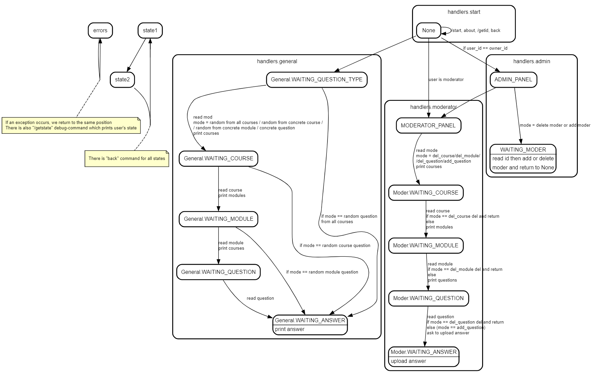

# ExamBot

A bot which will help you pass all exams.  
It can ask you random questions and send answers afterward.

There are three user's ranks: admin, moderator, and user, also three levels of questions select:
* `Questions` merges to `Modules`, `Modules` merges to `Courses`
* `User` can select concrete or random question (random from all courses, from the concrete course or concrete module)
* `Moderator` can add or delete new `courses, modules, question`
* `Admin` can add or delete `Moderators`

MongoDB is used to store states in FSM

## Examples


## FSM image



## Run

0. Install [mongoDB](https://www.mongodb.com/)
1. Clone this repo
> `git clone https://github.com/Dalvikk/ExamBot`
2. Install dependencies
> `cd ExamBot/`  
> `pip3 install --no-cache-dir -r requirements.txt`
3. Set environment variables
> `set PYTHONPATH="." (on Windows)`  

Let Python know that the package is here, otherwise it raise a exception «module exam_bot not found»  
Now set up other environment variables or write them directly in config.py

```
set TOKEN="<Bot's token here>"
set OWNER_ID="<Admin id>"
set FILES_PATH="<Path to directory with questions>" # Ex: "./files"
set DB_NAME="aiogram"
set PORT ="27017"
set HOST="localhost"
set SEND_ERRORS="True" // "True" if you want that exceptions message will sent to you
```
4. Make sure Mongodb is running
5. Run  
>  `python ./exam_bot/bot.py`
> 
> 
## TODO list
* Add multi-language support
* New feature: users will be able to rate themselves, and the bot will collect statistics. The functions "give the question with the worst rating" will be added
* Reminder: ask a random question every `n` minutes
* Fix bugs related to race condition
* Optimize files sending by sending file_id which will be stored for each file
